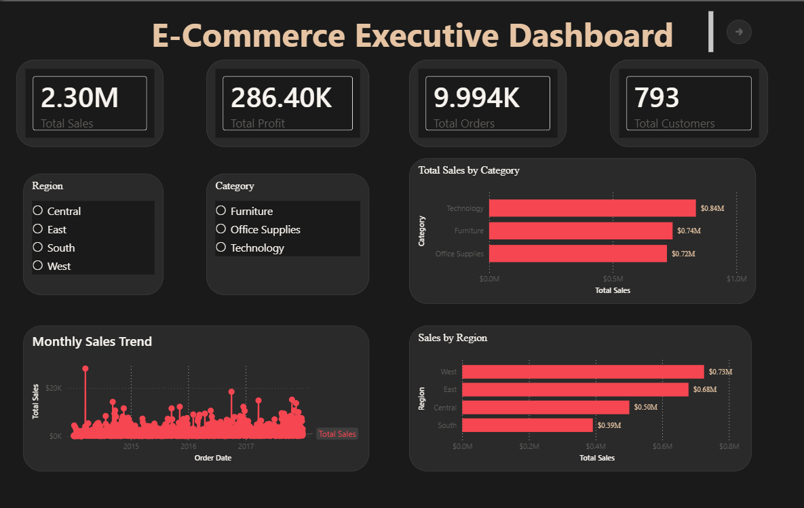
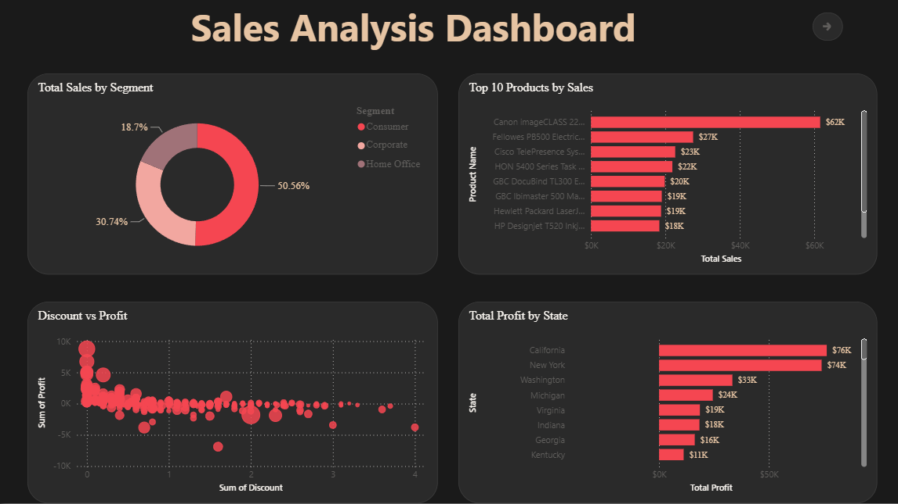
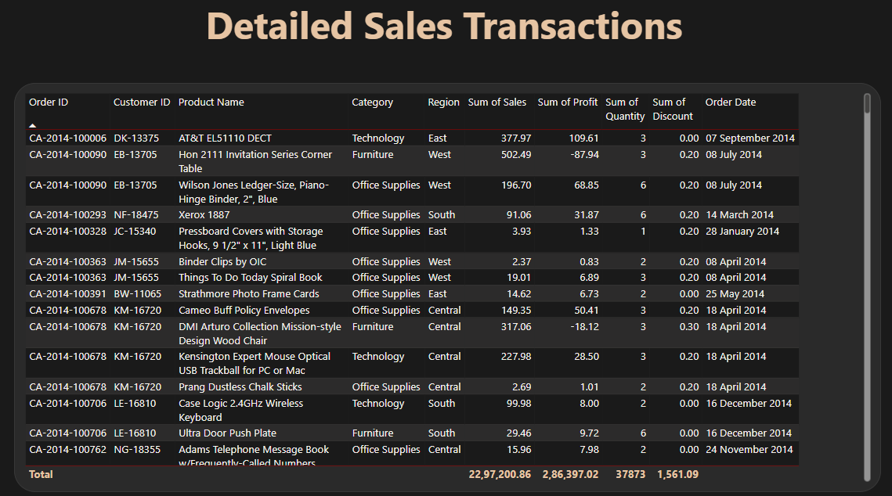

# 📊 End-to-End E-Commerce Sales Analytics

An end-to-end data analytics project demonstrating the complete analytics lifecycle—from raw data cleaning and exploratory analysis using **Python**, business insights using **SQL**, and interactive dashboard development in **Power BI**.

---

# 🚀 Project Overview

Businesses generate massive amounts of sales data every day. Turning that data into actionable insights requires multiple stages of analysis.

This project walks through the complete analytics pipeline:

```
Raw Dataset
      │
      ▼
Python
(Data Cleaning & EDA)
      │
      ▼
SQL
(Business Analysis)
      │
      ▼
Power BI
(Interactive Dashboard)
      │
      ▼
Business Insights
```

The project answers important business questions such as:

- 📈 How are sales changing over time?
- 💰 Which categories generate the highest revenue?
- 🌍 Which regions perform the best?
- 👥 Which customer segment contributes the most sales?
- 📉 How does discount impact profitability?
- 🏆 Which products generate the highest sales?
- 📍 Which states generate the highest profit?
- 📄 What are the detailed transactions behind the dashboard?

---

# 🛠️ Tech Stack

- Python
- Pandas
- NumPy
- Jupyter Notebook
- SQL
- Power BI
- Power Query
- DAX
- Git
- GitHub

---

# 📂 Project Structure

```
Ecommerce-Analytics/
│
├── dashboards/
│   ├── Ecommerce_Analytics.pbix
│   └── Glassmorphism_Theme.json
│
├── data/
│   ├── raw/
│   │   └── Sample - Superstore.csv
│   │
│   └── cleaned/
│       └── superstore_cleaned.csv
│
├── notebooks/
│   ├── 01_Data_Understanding.ipynb
│   ├── 02_Data_Cleaning.ipynb
│   └── 03_EDA.ipynb
│
├── sql/
│   ├── 01_create_table.sql
│   ├── 02_basic_queries.sql
│   ├── 03_intermediate_queries.sql
│   ├── 04_advanced_queries.sql
│   └── 05_business_case_studies.sql
│
├── images/
│   ├── executive-dashboard.png
│   ├── sales-analysis.png
│   └── order-details.png
│
├── README.md
└── requirements.txt
```

---

# 🐍 Python Analysis

The project begins with Python-based data preparation and exploratory analysis.

### Completed Tasks

- Dataset exploration
- Missing value analysis
- Data cleaning
- Data preprocessing
- Feature understanding
- Exploratory Data Analysis (EDA)
- Sales trend analysis
- Profit distribution
- Category analysis
- Regional analysis

**Libraries Used**

- Pandas
- NumPy
- Matplotlib
- Seaborn

---

# 🗄️ SQL Analysis

SQL was used to answer business questions from cleaned data.

### SQL Modules

- Database Creation
- Basic Queries
- Intermediate Queries
- Advanced Queries
- Business Case Studies

### Sample Business Questions

- Top selling products
- Monthly sales trend
- Highest profit states
- Region-wise sales
- Customer purchasing behaviour
- Average order value
- Category-wise performance

---

# 📊 Power BI Dashboard

The cleaned dataset was imported into Power BI to create an interactive business intelligence dashboard.

## Dashboard Pages

### 🏠 Executive Dashboard

Provides a high-level overview of business performance.

### KPIs

- Total Sales
- Total Profit
- Total Orders
- Total Customers

### Visualizations

- Sales by Category
- Sales by Region
- Monthly Sales Trend

### Filters

- Region
- Category

---

### 📈 Sales Analysis Dashboard

Provides detailed sales insights.

### Visualizations

- Sales by Customer Segment
- Top 10 Products by Sales
- Discount vs Profit Analysis
- Top States by Profit

---

### 📄 Order Details Dashboard

Transaction-level drill-down report.

Displays

- Order ID
- Customer ID
- Product Name
- Category
- Region
- Sales
- Profit
- Quantity
- Discount
- Order Date

---

# 📸 Dashboard Preview

## Executive Dashboard



---

## Sales Analysis Dashboard



---

## Order Details Dashboard



---

# 📌 Key Business Insights

- Technology is the highest revenue-generating category.
- Consumer segment contributes the largest share of sales.
- West region generates the highest sales.
- High discounts generally reduce profitability.
- A small number of products contribute significantly to overall revenue.
- California and New York generate the highest profits.

---

# 🎯 Skills Demonstrated

- Data Cleaning
- Data Wrangling
- Exploratory Data Analysis
- Business Intelligence
- SQL Querying
- Dashboard Design
- Data Visualization
- Power Query
- DAX
- KPI Development
- Business Storytelling

---

# 📈 Future Improvements

- Customer Retention Dashboard
- Sales Forecasting
- Profit Prediction using Machine Learning
- Inventory Analysis
- Customer Segmentation
- Time Series Forecasting

---

# ⭐ If you found this project useful

Please consider giving this repository a ⭐ on GitHub.

---

## 👨‍💻 Author

**Tejavath Mani Deepak**

B.Tech Chemical Engineering  
National Institute of Technology Warangal

GitHub: https://github.com/manideepak8ii

LinkedIn: https://www.linkedin.com/in/mani-deepak-tejavath-9bb90420b/
